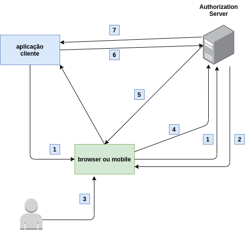

# Recomendação de utilização para o grant type _Authorization Code_

Esse fluxo é recomendado para aplicações que realizem interações com usuário final, normalmente
essas aplicações fazem essa interface via browser ou aplicações mobile.

Nesse fluxo não precisamos informar um **client_secret**, quando realizamos o cadastro de nossa aplicação cliente
no nosso IAM precisamos informar um URL para que o Authorization Server faça os devidos redirecionamentos.

Logo nesse fluxo só precisamos de **client_id** na parte da aplicação cliente.

* **1** - A aplicação cliente inicia o processo de autenticação redirecionando o usuário para 
          o Authorization Server, esse processo acontece via Browser ou aplicação mobile  
* **2** - O Authorization Server _prompt_ tela para usuário digitar credencial
* **3** - O usuário Resource Owner digita suas credenciais 
* **4** - A aplicação mobile ou browser submeter as informações para o Authorization Server
* **5** - O Authorization Server redireciona o usuário (via browser) junto com um código de autorização **auth_code** 
* **6** - A aplicação cliente troca o código de autorização por um token de acesso
* **7** - O Authorization Server responde com o novo token de acesso
 
## Informações de Suporte  

* Em algum momento você pode ter pensado em entender os detalhes da requisição de um token
 usando _auth_code_. [Aqui você pode encontrar esse conteúdo](https://oauth.net/2/grant-types/authorization-code/)

* Ou talvez você possa ter ficado com alguma dúvida específica sobre o fluxo. Neste caso recomendamos que [você consulte a RFC](https://tools.ietf.org/html/rfc6749#section-1.3.1), nela você pode 
encontrar todos os detalhes  

* Talvez você possa estar pensando, tem alguma maneira de eu colocar ainda mais segurança nesse fluxo. [Esse link
ensina como](https://auth0.com/docs/flows/call-your-api-using-the-authorization-code-flow) 
 